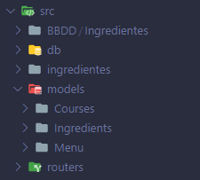
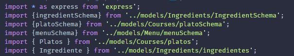

# Práctica 11 - API Node/Express de gestión de información nutricional
## Desarrollo de Sistemas Informáticos - Grupo q

### Introducción

En este informe se resumen las actividades realizadas en la **práctica 11** para poner en práctica nuestros conocimientos de API Node/Exprees. Será la segunda práctica grupal y deberemos usar todas las herramientas aprendidas con anterioridad, además utilizaremos Mongodb y se deberá desplegar la API en Heroku.


### Objetivos

Al finalizar la práctica, habremos completado los siguientes objetivos:

* Manejar con destresa un servidor we a través de node/express.
* Llevar a cabo en la API, las operaciones de creación, lectura, modificación y borrado de ingredientes, platos y menus.
* Dominar el correcto uso conjunto de todas las distintas estructuras y tipos de datos.
* Aprender a usar el módulo MongoDb para la gestión de una base de datos.


### 1. Creación y configuración del driectorio del proyecto.

#### 1.1 Estructura inicial

Para la creación de la estructura inicial, utilizaremos el mismo diseño que hemos implementado en practicas anteriores (por ejemplo, [práctica 4](https://github.com/ULL-ESIT-INF-DSI-2021/ull-esit-inf-dsi-20-21-prct04-arrays-tuples-enums-alu0101203003/blob/gh-pages/index.md)).

La estructura debería quedar similar a las siguientes fotos:

 

#### 1.2. Organización de los ejercicios

Será necesario implementar las clases del ejercicio en ficheros diferentes. Los ficheros que dependan de otros requeriran de un `import` del fichero que necesiten:

 

Se creará una subcarpeta para cada apartado del ejercicio en la carpeta src y, su correspondiente espectativa se crearán en la carpeta test con un fichero para realizar las pruebas de cada apartado.


### 2. Ejercicio

Se pasa a explicar la resolución del ejercicio y a adjuntar su código. Se mostrará una versión simplificada del enunciados del ejercicio (para verlo al completo con aclaraciones y pistas, consultar la [guía de la práctica](https://ull-esit-inf-dsi-2021.github.io/prct11-menu-api/).

### 2.1 Enunciados de las diferentes partes del proyecto
#### 2.1.1 Alimentos y/o ingredientes

**Enunciado:**

Para cada alimento o ingrediente se deberá poder crear, leer, actualizar o borrar un ingrediente a través de los métodos HTTP necesarios, donde cada ingrediente considerado dentro del sistema de menus se debe almacenar la información siguiente:

1. Grupo de alimentos al que pertenece que puede ser:
  * Carnes, pescados, huevos, tofu, frutos secos, semillas y legumbres.
  * Verduras y hortalizas.
  * Leche y derivados.
  * Cereales.
  * Frutas.
2. La composición nutricional del alimento con respecto a los macronutrientes y kcal por 100 gr de dicho alimento.
  * Macronutrientes: Hidratos de carbono, proteínas y lípidos.
3. Precio del alimento y/o ingrediente por kg en euros.

Además, un alimento tendrá un nombre y localización de origen: país y ciudad.


#### 2.1.2 Platos

**Enunciado:**

Al igual que con los ingredientes, se deberá poder crear, leer, actualizar o borrar un plato a través de los métodos HTTP necesarios.

Los platos de un menú estarán compuestos por alimentos y/o ingredientes como los definidos anteriormente. Además, deberá considerar que un plato puede pertener a cuatro categorías distintas: entrante, primer plato, segundo plato y postre. Asimismo, para cada plato dentro del sistema se debería poder acceder a la siguiente información:

1. Lista de alimentos y/o ingredientes que lo componen.
2. Composición nutricional del plato. Esto es, la suma de la composición nutricional de los alimentos que componen el plato. Hay que tener en cuenta que los valores nutricionales se definen por 100 gr de ingrediente, pero no siempre se usan 100 gr de cada ingrediente para elaborar un plato.
3. Grupo de alimento predominante. Este atributo deberá definir el grupo de alimento que más aparece entre los ingredientes del plato (véase la lista de en el apartado Alimentos).
4. Precio total del plato en euros en función de la suma de los precios de los ingredientes y sus cantidades que lo componen.


#### 2.1.3 Menús

**Enunciado:**

En la ruta /menus del API, se deberá poder crear, leer, actualizar o borrar un menú a través de los métodos HTTP necesarios.

Un menú estará compuesto por platos, incluyendo un plato de cada categoría o, al menos, tres de ellas. Para cada menú, se debe poder consultar la siguiente información:

1. Precio total del menú en euros.
2. Platos que lo componen con sus correspodientes alimentos y/o ingredientes.
3. Composición nutricional del menú de acuerdo a lo definido en el punto 2 de la sección Alimentos.
4. Listado de grupos de alimentos por orden de aparición.


### 2.2 Schemas de las diferentes partes del proyecto
#### 2.2.1 Schema de ingredientes

 Después de añadir la información necesaria de la práctica grupal anterior para la implementación de ingredientes, a la cual podemos acceder a través de la [guía de ingredientes](https://github.com/ULL-ESIT-INF-DSI-2021/ull-esit-inf-dsi-20-21-prct11-menu-api-grupo-q/tree/master/src/models/Ingredients). Después de tener esto agregado a nuestro proyecto, tendremos que crear un `schema` haciendo uso de la herramienta `mongoose`, el cual va a contener la estructura básica de cualquier ingrediente en formato **JSON**. Por lo que, la estructura que nos debería quedar sería como la que vemos en el siguiente enlace:
 
 * [Schema ingredientes](https://github.com/ULL-ESIT-INF-DSI-2021/ull-esit-inf-dsi-20-21-prct11-menu-api-grupo-q/blob/master/src/models/Ingredients/IngredientSchema.ts).

Donde tenemos, un **nombre**, el **grupo** al que pertenece el ingrediente, la **composición nutricional** del ingrediente, el cual se compone de [**lípidos, hidratos de carbono, proteínas y kCalorías**], la **localizaciçón** [**ciudad y país de origen**] y finalmente el **precio** del ingrediente en cuestión.

#### 2.2.2 Schema de platos

 Después de añadir la información necesaria de la práctica grupal anterior para la implementación de platos, a la cual podemos acceder a través de la [guía de platos](https://github.com/ULL-ESIT-INF-DSI-2021/ull-esit-inf-dsi-20-21-prct11-menu-api-grupo-q/tree/master/src/models/Courses). Después de tener esto agregado a nuestro proyecto, tendremos que crear un `schema` haciendo uso de la herramienta `mongoose`, el cual va a contener la estructura básica de cualquier plato en formato **JSON**. Por lo que, la estructura que nos debería quedar sería como la que vemos en el siguiente enlace:
 
 * [Schema plato](https://github.com/ULL-ESIT-INF-DSI-2021/ull-esit-inf-dsi-20-21-prct11-menu-api-grupo-q/blob/master/src/models/Courses/platoSchema.ts).

Donde tenemos, un **nombre**, un array que contiene los **ingredientes** del plato, donde cada ingrediente es de tipo `ingredientChema`, es decir, que tendrá la estructura que nombramos en el apartado anterior y finalmente el **precio** del ingrediente en cuestión.

#### 2.2.3 Schema de menus

 Después de añadir la información necesaria de la práctica grupal anterior para la implementación de menus, a la cual podemos acceder a través de la [guía de menus](https://github.com/ULL-ESIT-INF-DSI-2021/ull-esit-inf-dsi-20-21-prct11-menu-api-grupo-q/tree/master/src/models/Menu). Después de tener esto agregado a nuestro proyecto, tendremos que crear un `schema` haciendo uso de la herramienta `mongoose`, el cual va a contener la estructura básica de cualquier menú en formato **JSON**. Por lo que, la estructura que nos debería quedar sería como la que vemos en el siguiente enlace:
 
 * [Schema menu](https://github.com/ULL-ESIT-INF-DSI-2021/ull-esit-inf-dsi-20-21-prct11-menu-api-grupo-q/blob/master/src/models/Menu/menuSchema.ts).

Donde tenemos, un **nombre**, un array que contiene los **platos** del menu, donde cada plato es de tipo `platoSchema`, es decir, que tendrá la estructura que nombramos en el apartado anterior.

### 2.3. Operaciones CRUD

Nuestra API tendrá implementadas las operaciones básicas de creación, lectura, modificación y borrado (**CRUD**) que actúan sobre nuestras distintas bases de datos haciéndolas interactivas.

Se resumen los puntos claves del código para explicar las operaciones ([ver código completo](https://github.com/ULL-ESIT-INF-DSI-2021/ull-esit-inf-dsi-20-21-prct11-menu-api-grupo-q/tree/master/src/routers)).

### 2.3.1 Creación

A través de esta operación, se añade un nuevo elemento a la base de datos correspondiente (durante la operación se manejarán los posibles errores con la ayuda de [promesas](https://ull-esit-inf-dsi-2021.github.io/nodejs-theory/nodejs-promises.html)). Para ello: 

* Usaremos una instancia de express encargada del direccionamiento que llamaremos **postRouter** (ya que el método de ruta deriva en el método HTTP **POST** que manda la petición al servidor de añadir el elemento).

```ts
export const postRouter = express.Router();
```

* Necesitaremos un elemento (Ingrediente, menú o plato) en base al modelo que hace uso de su Schema (definido anteriormente). (Este elemento será obtenido típicamente usando Thunder Client)

```ts
const ingrediente = new ingredientSchema(req.body);
```
* Añadiremos el elemento haciendo uso de la función `save()`

```ts
postRouter.post('/ingredients', (req, res) => {
  const ingrediente = new ingredientSchema(req.body);

  ingrediente.save().then((ingrediente) => {
    res.status(201).send(ingrediente);
  }).catch((error) => {
    res.status(400).send(error);
  });
});
```

### 2.3.2 Lectura

A través de esta operación, se lee un elemento de la base de datos correspondiente (durante la operación se manejarán los posibles errores con la ayuda de [promesas](https://ull-esit-inf-dsi-2021.github.io/nodejs-theory/nodejs-promises.html)). Para ello: 

* Usaremos una instancia de express encargada del direccionamiento que llamaremos **getRouter** (ya que el método de ruta deriva en el método HTTP **GET** que manda la petición al servidor de obtener el elemento indicado).

```ts
export const getRouter = express.Router();
```

* Filtraremos la base de datos en función del nombre del elemento (Ingrediente, menú o plato). (Esta petición será manejada haciendo uso de Thunder Client)

```ts
const filter = req.query.nameIngredient?{nombre: req.query.nameIngredient.toString()}:{};
```
* Buscaremos el elemento concreto por su nombre haciendo uso de la función `findOne()`

```ts
getRouter.get('/ingredients', (req, res) => {

    const filter = req.query.nameIngredient?{nombre: req.query.nameIngredient.toString()}:{};

    ingredientSchema.findOne(filter).then((ingredient) => {
      if (ingredient == null) {
        res.status(401).send();
      } 
      else {
          res.send(ingredient);
      }
    }).catch(() => {
      res.status(400).send();
    });
});
```

### 2.3.3 Modificación

A través de esta operación, se modifica un elemento de la base de datos correspondiente (durante la operación se manejarán los posibles errores con la ayuda de [promesas](https://ull-esit-inf-dsi-2021.github.io/nodejs-theory/nodejs-promises.html)). Para ello: 

* Usaremos una instancia de express encargada del direccionamiento que llamaremos **patchRouter** (ya que el método de ruta deriva en el método HTTP **PATCH** que manda la petición al servidor de actualizar los valores del elemento indicado).

```ts
export const patchRouter = express.Router();
```

* Se especificarán los cambios válidos para cada elemento (Ingrediente, menú o plato) y se llevará a cabo la validación de los valores actuales. (Esta petición será manejada haciendo uso de Thunder Client)

```ts
const allowedUpdates = ['nombre', 'grupo', 'composicionNutricional', 'localizacion', 'precio'];
const actualUpdates = Object.keys(req.body);
const isValidUpdate = actualUpdates.every((update) => allowedUpdates.includes(update));
```
* Si los cambios son váidos, los efectuaremos en el elemento indicado haciendo uso de la función `findOneAndUpdate()`

```ts
patchRouter.patch('/ingredients', (req, res) => {
  if (!req.query.nameIngredient) {
    res.status(400).send({
      error: 'A name must be provided',
    });
  } else {
    const allowedUpdates = ['nombre', 'grupo', 'composicionNutricional', 'localizacion', 'precio'];
    const actualUpdates = Object.keys(req.body);
    const isValidUpdate =
      actualUpdates.every((update) => allowedUpdates.includes(update));

    if (!isValidUpdate) {
      res.status(400).send({
        error: 'Update is not permitted',
      });
    } else {
      ingredientSchema.findOneAndUpdate({nombre: req.query.nameIngredient.toString()}, req.body, {
        new: true,
        runValidators: true,
      }).then((ingrediente) => {
        if (!ingrediente) {
          res.status(404).send();
        } else {
          res.send(ingrediente);
        }
      }).catch((error) => {
        res.status(400).send(error);
      });
    }
  }
});
```

### 2.3.4 Borrado

A través de esta operación, se elimina un elemento de la base de datos correspondiente (durante la operación se manejarán los posibles errores con la ayuda de [promesas](https://ull-esit-inf-dsi-2021.github.io/nodejs-theory/nodejs-promises.html)). Para ello: 

* Usaremos una instancia de express encargada del direccionamiento que llamaremos **deleteRouter** (ya que el método de ruta deriva en el método HTTP **DELETE** que manda la petición al servidor de eliminar el elemento indicado).

```ts
export const deleteRouter = express.Router();
```

* Filtraremos la base de datos en función del nombre del elemento (Ingrediente, menú o plato) que deseamos eliminar. (Esta petición será manejada haciendo uso de Thunder Client)

```ts
const filter = req.query.nameIngredient?{nombre: req.query.nameIngredient.toString()}:{};
```
* Buscaremos el elemento concreto por su nombre y lo eliminaremos haciendo uso de la función `findOneAndDelete()`

```ts
deleteRouter.delete('/ingredients', (req, res) => {
  if (!req.query.nameIngredient) {
    res.status(400).send({
      error: 'A ingredient name must be provided',
    });
  } else {
    ingredientSchema.findOneAndDelete({nombre: req.query.nameIngredient.toString()}).then((ingrediente) => {
      if (!ingrediente) {
        res.status(404).send();
      } else {
        res.send(ingrediente);
      }
    }).catch(() => {
      res.status(400).send();
    });
  }
});
```

### 2.4. Thunder Client

Algunas peticiones (como *POST*) no se pueden realizar a través del navegador. 

Thunder Client es una herramienta que nos permite probar e interactuar con nuestra API. A través de ella, se le indica al servidor el método HTTP usado en la petición permitiéndonos realizar las operaciones CRUD sobre nuestra base de datos.

### 2.4.1 Modo de uso


### Conclusiones

Esta práctica nos ha resultado de gran utilidad para poner en práctica todos los conocimientos, herramientas, principios ... aprendidos hasta la fecha. Hemos aprendido ampliamente sobre los coneceptos necesarios para el diseño y manipulación de bases de datos a través de una API REST con la que podremos interactuar y realizar las operaciones principales.

Las bases de datos son un recurso imprescindible para casi cualquier proyecto que hagamos tanto en la actualidad como en el futuro, sin duda les daremos un uso intensivo a lo largo de nuestra trayectoria.

### Bibliografía

A continuación se muestra una serie de recursos que han sido de gran utilidad para la realización de la práctica y de este informe:

Recurso| Dirección
-------|----------
Guía de la práctica | https://ull-esit-inf-dsi-2021.github.io/prct11-menu-api/
Apuntes | https://ull-esit-inf-dsi-2021.github.io/nodejs-theory/

