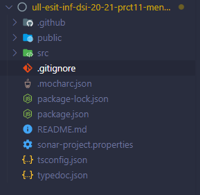
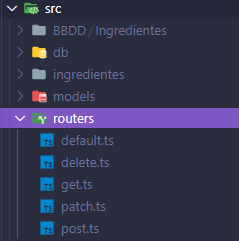

# Práctica 11 - API Node/Express de gestión de información nutricional
## Desarrollo de Sistemas Informáticos 
## Grupo Q

### Introducción

En este informe se resumen las actividades realizadas en la **práctica 11** para poner en práctica nuestros conocimientos de API Node/Exprees. Será la segunda práctica grupal y deberemos usar todas las herramientas aprendidas con anterioridad, además utilizaremos Mongodb y se deberá desplegar la API en Heroku.

### Objetivos

Al finalizar la práctica, habremos completado los siguientes objetivos:

* Manejar con destresa un servidor we a través de node/express 
* Llevar a cabo en la API, las operaciones de creación, lectura, modificación y borrado de ingredientes, platos y menus.
* Dominar el correcto uso conjunto de todas las distintas estructuras y tipos de datos
* Aprender a usar el módulo MongoDb para la gestión de una base de datos 

### 1. Creación y configuración del driectorio del proyecto.

#### 1.1. Estructura inicial

Para la creación de la estructura inicial, utilizaremos el mismo diseño que hemos implementado en practicas anteriores (por ejemplo, [práctica 4](https://github.com/ULL-ESIT-INF-DSI-2021/ull-esit-inf-dsi-20-21-prct04-arrays-tuples-enums-alu0101203003/blob/gh-pages/index.md)).

La estructura debería quedar similar a las siguientes fotos:

  

#### 1.2. Organización de los ejercicios

Será necesario implementar las clases del ejercicio en ficheros diferentes. Los ficheros que dependan de otros requeriran de un `import` del fichero que necesiten:

 

Se creará una subcarpeta para cada apartado del ejercicio en la carpeta src y, su correspondiente espectativa se crearán en la carpeta test con un fichero para realizar las pruebas de cada apartado.

### 2. Ejercicio

Se pasa a explicar la resolución del ejercicio y a adjuntar su código y expectativa. Se mostrará una versión simplificada del enunciados del ejercicio (para verlo al completo con aclaraciones y pistas, consultar la [guía de la práctica](https://ull-esit-inf-dsi-2021.github.io/prct11-menu-api/).
